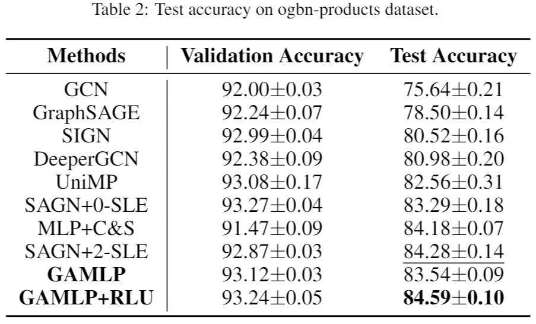
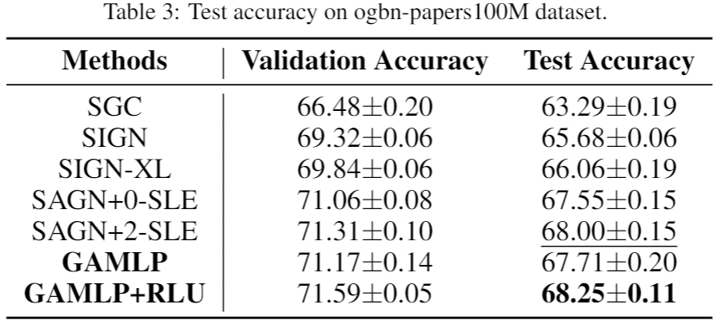
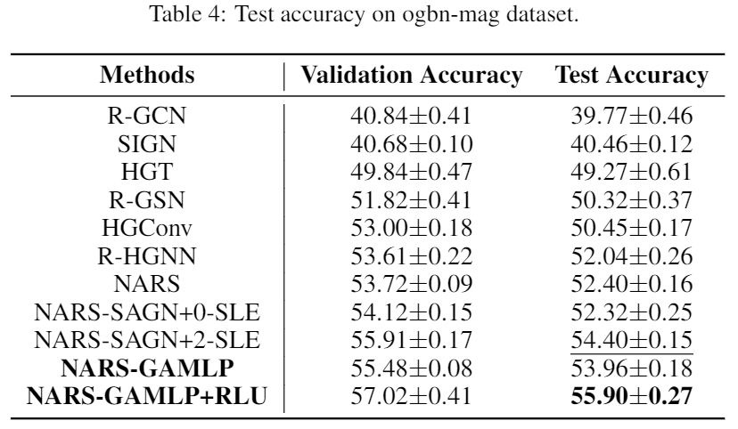

# Graph Attention Multi-Layer Perceptron

## Environments

Implementing environment: Xeon(R) Platinum 8255C (CPU), 376GB(RAM), Tesla V100 32GB (GPU), Ubuntu 16.04 (OS).

## Requirements

The PyTorch version we use is torch 1.7.1+cu101. Please refer to the official website -- https://pytorch.org/get-started/locally/ -- for the detailed installation instructions.

To install other requirements:

```setup
pip install -r requirements.txt
```
## preprocess

To generate the ComplEx embedding of ogbn-mag, we provide the bash command in the ./data/, you can follow the instruction in the https://github.com/facebookresearch/NARS

To generate the embedding of ogbn-papers100M, we also provide python script in the ./data/ folder. You can do the feature process before training.


## Training

To reproduce the results of **GAMLP+RLU** on OGB datasets, please run following commands.

For **MAXP**:

```bash
cd scripts/
nohup bash train_maxp.sh > ../output/gamlp.log 2>&1 &

# or
python3 main.py --use-rlu --method R_GAMLP_RLU --stages 10 10 10 --train-num-epochs 0 0 0 --threshold 0.85 --input-drop 0.2 --att-drop 0.5 --label-drop 0 --pre-process --residual --dataset maxp --num-runs 1 --eval 5 --act leaky_relu --batch 50000 --patience 300 --n-layers-1 4 --n-layers-2 4 --bns --gama 0.1 --all-train
```

For **ogbn-products**:

###### Params: 3335831

```bash
python3 main.py --use-rlu --method R_GAMLP_RLU --stages 400 300 300 300 --train-num-epochs 0 0 0 0 --threshold 0.85 --input-drop 0.2 --att-drop 0.5 --label-drop 0 --pre-process --residual --dataset ogbn-products --num-runs 10 --eval 10 --act leaky_relu --batch 50000 --patience 300 --n-layers-1 4 --n-layers-2 4 --bns --gama 0.1
```

For **ogbn-papers100M**:

###### Params: 16308751

```bash
python ./data/preprocess_papers100m.py --num-hops 6

python main.py --use-rlu --method R_GAMLP_RLU --stages 100 150 150 150 --train-num-epochs 0 0 0 0 --threshold 0 --input-drop 0 --att-drop 0 --label-drop 0 --dropout 0.5 --pre-process --dataset ogbn-papers100M --num-runs 3 --eval 1 --act sigmoid --batch 5000 --patience 300 --n-layers-2 6 --label-num-hops 9 --num-hops 6 --hidden 1024 --bns --temp 0.001
```

For **ogbn-mag**:

###### Params: 6734882

```bash
python main.py --use-rlu --method JK_GAMLP_RLU --stages 250 200 200 200 --train-num-epochs 0 0 0 0 --threshold 0.4 --input-drop 0.1 --att-drop 0 --label-drop 0 --pre-process --residual --dataset ogbn-mag --num-runs 10 --eval 10 --act leaky_relu --batch 10000 --patience 300 --n-layers-1 4 --n-layers-2 4 --label-num-hops 3 --bns --gama 10 --use-relation-subsets ./data/mag --emb_path ./data/
```

To reproduce the results of **GAMLP**, run only the first stage will do the job.


## Node Classification Results:

Performance comparison on **ogbn-products**:



Performance comparison on **ogbn-papers100M**:



Performance comparison on **ogbn-mag**:


